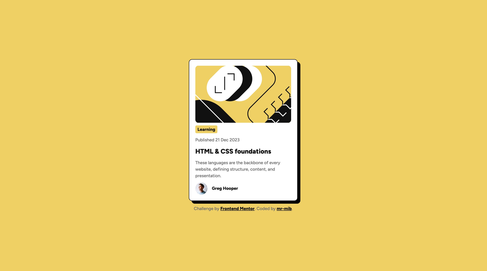

# Frontend Mentor - Blog preview card solution

This is a solution to the [Blog preview card challenge on Frontend Mentor](https://www.frontendmentor.io/challenges/blog-preview-card-ckPaj01IcS). Frontend Mentor challenges help you improve your coding skills by building realistic projects.

## Table of contents

- [Frontend Mentor - Blog preview card solution](#frontend-mentor---blog-preview-card-solution)
  - [Table of contents](#table-of-contents)
  - [Overview](#overview)
    - [The challenge](#the-challenge)
    - [Screenshot](#screenshot)
    - [Links](#links)
  - [My process](#my-process)
    - [Built with](#built-with)
    - [What I learned](#what-i-learned)
      - [Integrating the Figtree Font](#integrating-the-figtree-font)
      - [Dynamic Font Management with CSS Variables](#dynamic-font-management-with-css-variables)
    - [Continued development](#continued-development)
    - [Useful resources](#useful-resources)
  - [Author](#author)
  - [Acknowledgments](#acknowledgments)

## Overview

### The challenge

The challenge was to build out this blog preview card and get it looking as close to the design as possible.

### Screenshot



### Links

- Solution URL: [https://github.com/mr-mib/blog-preview-card](https://github.com/mr-mib/blog-preview-card)
- Live Site URL: [https://mr-mib.github.io/blog-preview-card/](https://mr-mib.github.io/blog-preview-card/)

## My process

### Built with

- Semantic HTML5 markup
- CSS custom properties
- Flexbox

### What I learned

During this challenge, I discovered the `@font-face` CSS at-rule, a fundamental tool for embedding custom fonts directly into web projects. This allows for the use of specific typography that might not be available on a user's system, ensuring a consistent visual experience across different browsers and devices. You can find more details on MDN Web Docs: [Using @font-face](https://developer.mozilla.org/en-US/docs/Web/CSS/Reference/At-rules/@font-face).

#### Integrating the Figtree Font

In this project, we integrated the **Figtree** font. The following CSS snippet demonstrates how the different weights of the Figtree font were included using `@font-face`:

```css
@font-face {
  font-family: "Figtree-Medium";
  src: url("./assets/fonts/static/Figtree-Medium.ttf");
  font-weight: 500;
  font-display: swap;
}

@font-face {
  font-family: "Figtree-ExtraBold";
  src: url("./assets/fonts/static/Figtree-ExtraBold.ttf");
  font-weight: 800;
  font-display: swap;
}
```

- `font-family`: Defines the name for the font, which will be used later in other CSS rules.
- `src`: Specifies the path to the font file.
- `font-weight`: Associates a specific font weight with the declared font-family, allowing for different styles (e.g., medium, extra-bold) to be used under the same font family name.
- `font-display: swap`: This property determines how a font face is displayed based on whether and when it is ready to be used. `swap` gives the font face a zero second block period and an infinite swap period, meaning the browser draws text immediately using a fallback font if the custom font is not yet loaded, and then swaps it with the custom font once it is available.

#### Dynamic Font Management with CSS Variables

While a direct application of `font-family: "Figtree-Medium", sans-serif;` is possible, a more maintainable and scalable approach involves using CSS variables (custom properties). This strategy centralizes font declarations, making it easier to manage and update typography across the entire project.

By defining font families as variables, any future changes to the project's typography only require a single modification in the `:root` selector, rather than searching and replacing multiple instances throughout the stylesheet. This significantly improves code maintainability and reduces the risk of inconsistencies.

Here's how CSS variables were implemented for font management:

```css
:root {
  --font-family-base: "Figtree-Medium", sans-serif;
  --font-family-heading: "Figtree-ExtraBold", sans-serif;
}

body {
  font-family: var(--font-family-base);
}

.blogCard-title {
  font-family: var(--font-family-heading);
}
```

- `:root`: This pseudo-class represents the `<html>` element and is where global CSS variables are typically declared.
- `--font-family-base` and `--font-family-heading`: These are custom properties (CSS variables) that store the preferred font stacks for general text and headings, respectively.
- `var(...)`: This function is used to retrieve the value of a CSS variable. For example, `font-family: var(--font-family-base);` applies the font stack defined in `--font-family-base` to the `body` element.

This method ensures a robust and flexible typography system, allowing for quick and efficient design adjustments.

### Continued development

Use this section to outline areas that you want to continue focusing on in future projects. These could be concepts you're still not completely comfortable with or techniques you found useful that you want to refine and perfect.

**Note: Delete this note and the content within this section and replace with your own plans for continued development.**

### Useful resources

- [mdn](https://developer.mozilla.org/en-US/docs/Web/CSS/Reference/At-rules/@font-face) - This helped understand font-face.

## Author

- GitHub - [mr-mib](https://github.com/mr-mib)
- Frontend Mentor - [@mr-mib](https://www.frontendmentor.io/profile/mr-mib)
- Twitter - [@mr_mib_](https://x.com/mr_mib_)

## Acknowledgments

This project was completed independently as part of my learning journey.

Special acknowledgment to the Frontend Mentor platform for providing structured, real-world frontend challenges.
